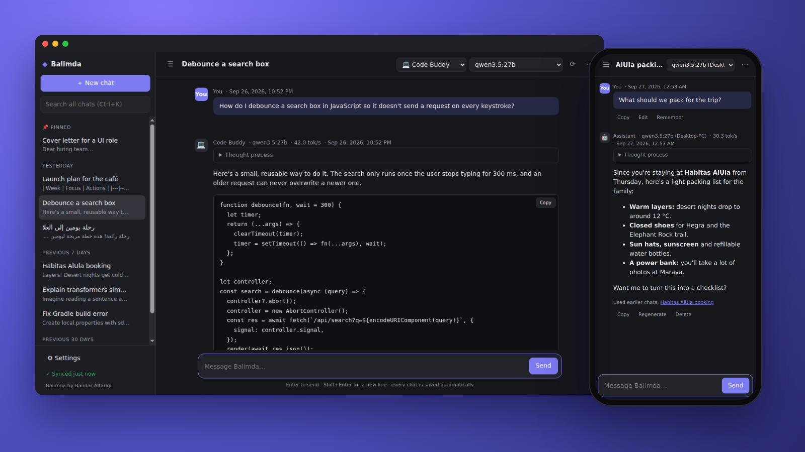
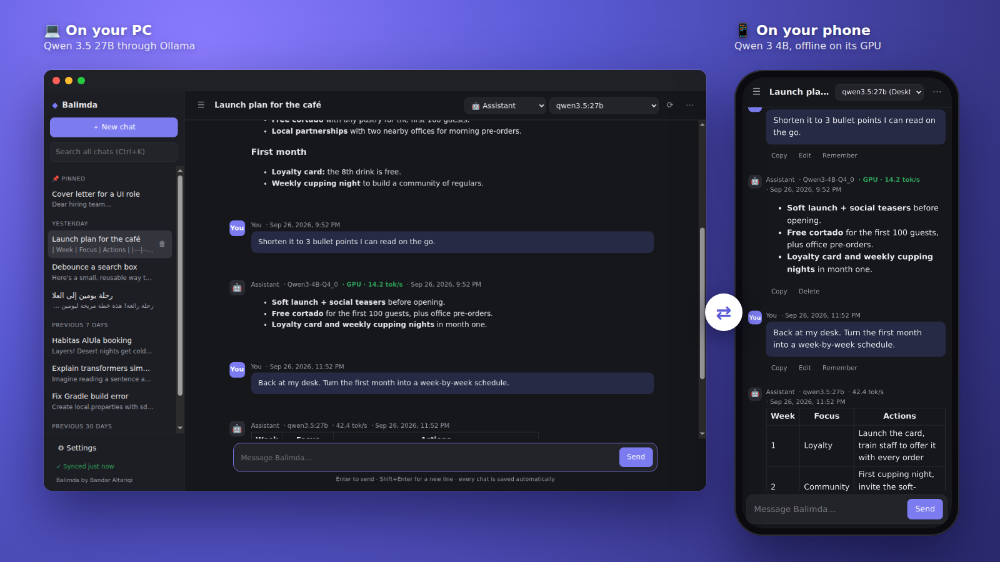
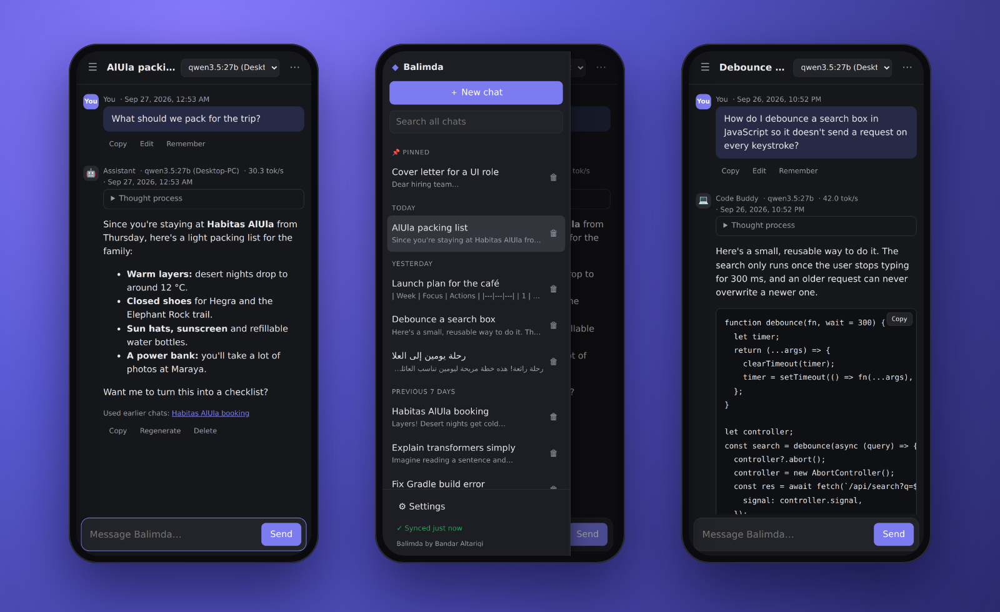
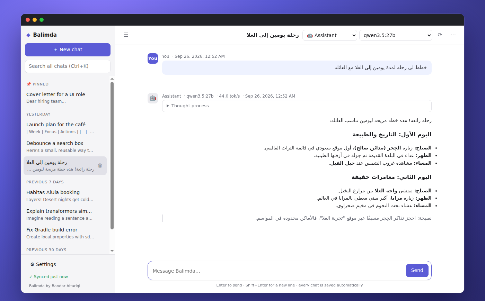
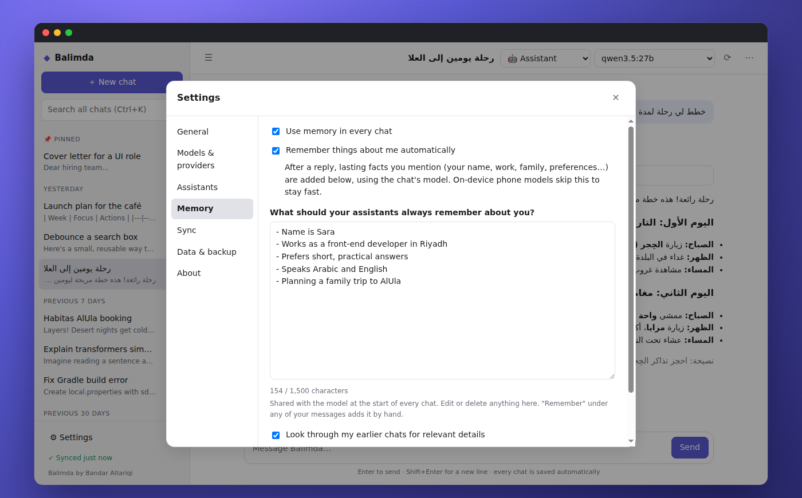

<div align="center">


# Balimda

### Your private AI, on every device you own.

Start a chat on your computer with a big model, continue the <b>same chat</b> on your phone with a small one,<br>
and finish it back at your desk. Your chats, memory and assistants stay in sync, encrypted end to end.

[](#download)
[](#download)
[](#download)
[](#download)
[](#run-ai-anywhere)
[](#license)
[](#for-businesses)

**[Download](#download)** · **[Features](#features)** · **[User guide](docs/GUIDE.md)** · **[For businesses](#for-businesses)** · **[Website](https://bandar9994.github.io/)** · **[Privacy](PRIVACY.md)**

<br>



</div>

<br>

## One chat. Every device. Any model.

Balimda keeps **the same conversation** on your phone and your computers, even when each device uses a different AI model. Nothing to copy, export or switch: open the chat on any device and keep going.

<div align="center">

</div>

| | Where you are | What happens |
|---|---|---|
| 💻 | **At your desk** | You start a chat with a large model on your PC, like Qwen 3.5 27B in Ollama. |
| 📱 | **On the go** | You open Balimda on your phone. The whole chat is already there, and the phone carries on with its own offline model, or with your PC's model over Wi-Fi or Tailscale. |
| 💻 | **Back home** | The PC shows everything you said on the phone and answers with the big model again. |

- **Every reply shows which model wrote it**, so you always know what answered.
- **Each device remembers its own model for each chat.** Your phone uses its model and your PC uses its own, automatically, with no switching.
- **The whole conversation goes along**, so a small phone model picks up right where the big model left off.
- **Nothing is lost.** Messages added on two devices before they synced are merged, and deleting a chat deletes it everywhere.
- **Memory and assistants follow you too**, so every device knows you just as well.

## Why Balimda?

Most AI apps send everything you type to someone else's servers, forget you the moment you close them, and live on one device. Balimda does the opposite.

<table>
<tr>
<td width="33%" valign="top">

### 🔒 Private by design
Run models on your own phone or computer, with no account and no internet. Balimda has no servers and collects nothing. When you sync, everything is encrypted on your device first.

</td>
<td width="33%" valign="top">

### 🧠 It remembers you
Balimda learns lasting facts about you as you chat, keeps them up to date, and looks back through your earlier conversations so you never have to repeat yourself.

</td>
<td width="33%" valign="top">

### 📱💻 One conversation, every device
The same chat continues on your phone and your computer, even with a different model on each. Your phone can also use your computer's big models, so a small device gets a big brain.

</td>
</tr>
</table>

<br>

## Features

### Run AI anywhere

- **Offline on your phone.** Download a model once (Qwen, Llama, Gemma and more), then chat with no internet at all. Balimda runs models with native [llama.cpp](https://github.com/ggml-org/llama.cpp) and uses the **Adreno GPU** on Snapdragon phones for faster replies. Any `.gguf` model link works too.
- **On your computer.** Use [Ollama](https://ollama.com), [LM Studio](https://lmstudio.ai), llama.cpp, Jan, vLLM or any OpenAI-compatible server. Big models like Qwen 27B run at full speed on your own hardware.
- **In the cloud, when you want it.** Anthropic Claude and OpenAI, with your own API key. Keys are stored on your device, encrypted with your system keychain on desktop.
- **Your phone, your computer's brain.** Turn on one switch on your computer, and your phone can chat with every model the computer has, including cloud models on the computer's API keys. The phone finds the computer through sync, with nothing to type, over an encrypted connection only your devices can use. It works on your home Wi-Fi, or anywhere with [Tailscale](https://tailscale.com).
- **The right model on each device.** Every chat remembers which model to use on each device: a small, fast model on the phone and a 27B model on the PC, in the same conversation.

### Memory that grows with you

- **Remembers automatically.** Mention your name, your job, your family or what you like, and Balimda adds it to memory by itself. A short note tells you what it learned.
- **Keeps facts current.** Say *"I moved to Jeddah"* and the old city is replaced, not duplicated. Things that no longer apply are forgotten.
- **Stays short and sharp.** Memory is capped at 1,500 characters and tidies itself up when it grows, so it never crowds out your conversation. You can read and edit every word in Settings.
- **Recalls earlier chats.** Before replying, Balimda looks through your past conversations, in English and Arabic, for relevant details. Replies that used them say so, with links back to those chats.

### Never lose a thought

- **Every chat is saved as it happens**, even a reply that's still being written. Close the app mid-sentence and you're back where you left off, including your half-typed message.
- **Search across all your chats**, pin favourites, rename and export any chat to Markdown.
- **Back up everything** to a single file and restore it on any device.

### Seamless, encrypted sync

- **Continue any chat on any device**, even when each device uses a different model. See [One chat. Every device. Any model.](#one-chat-every-device-any-model)
- **Sign in with Google** and your chats, assistants and memory follow you between your phone and computers. Balimda uses a hidden app folder in your Drive and can't see your other files. Developers can use a private GitHub repository instead.
- **End-to-end encrypted.** Everything is encrypted on your device with AES-256-GCM, using a key made from your own passphrase, before it's uploaded. Google or GitHub only ever see scrambled data.
- **Nothing gets lost.** If the same chat or your memory changed on two devices before they synced, the changes are merged. Delete a chat once and it's gone everywhere.

### A great chat experience

- **Streaming replies** with Stop, Regenerate, and Edit & resend.
- **Thinking models, tidied up.** Models that reason first (Qwen 3, DeepSeek-R1 and others) show a collapsed "Thought process" you can open when you're curious.
- **Assistants** with their own instructions and their own model. Assistant, Code Buddy and Writing Coach come built in; create as many as you like.
- **Beautiful Markdown and code**, with one-tap copy for code blocks.
- **Arabic and English.** Right-to-left text lays out naturally, and automatic memory and the look-back through earlier chats understand Arabic.
- **See the speed.** Replies from local models show tokens per second, and on the phone whether they ran on the GPU or the CPU.
- **Light and dark themes**, and keyboard shortcuts on desktop.

<br>

<div align="center">

<br><sub>On Android: chatting with the computer's 27B model and recalling an earlier chat · every chat, synced · code with syntax and copy</sub>
</div>

<br>

<table>
<tr>
<td width="50%"></td>
<td width="50%"></td>
</tr>
<tr>
<td align="center"><sub>Arabic, right to left, in light mode</sub></td>
<td align="center"><sub>Memory you can see and edit</sub></td>
</tr>
</table>

<br>

## Download

| Platform | Download | Notes |
|---|---|---|
| **Android** | [Balimda-android.apk](https://github.com/bandar9994/balimda/releases/download/android-latest/Balimda-android.apk) | Open it on your phone and allow installing from your browser. Updates install over the old version and keep your chats. |
| **Windows** 10/11 | [Balimda-Windows-Setup.exe](https://github.com/bandar9994/balimda/releases/download/desktop-latest/Balimda-Windows-Setup.exe) | If SmartScreen appears, choose **More info → Run anyway**. |
| **Mac** (M1 and newer) | [Balimda-macOS-AppleSilicon.dmg](https://github.com/bandar9994/balimda/releases/download/desktop-latest/Balimda-macOS-AppleSilicon.dmg) | Drag Balimda to Applications. The first time, right-click it and choose **Open**. |
| **Mac** (Intel) | [Balimda-macOS-Intel.dmg](https://github.com/bandar9994/balimda/releases/download/desktop-latest/Balimda-macOS-Intel.dmg) | Same as above. |
| **Linux** | [AppImage](https://github.com/bandar9994/balimda/releases/download/desktop-latest/Balimda-Linux.AppImage) · [.deb](https://github.com/bandar9994/balimda/releases/download/desktop-latest/Balimda-Linux.deb) | |

iOS is on the way.

## Get started in three steps

1. **Install Balimda** on your phone, your computer, or both.
2. **Pick a model.** On the phone, open **Settings → Models & providers** and download one (Qwen 2.5 1.5B is a great start, and it speaks Arabic). On the computer, install [Ollama](https://ollama.com) and run `ollama pull qwen3:8b`, or paste a Claude or OpenAI key.
3. **Turn on sync** (optional) in **Settings → Sync** on each device with the same Google account and passphrase. Then turn on **Let my phone use this computer's models** on your computer if you'd like your phone to use it.

The **[user guide](docs/GUIDE.md)** covers everything else: the model list, GPU tips, sync, using your computer's models away from home, where your data lives, and keyboard shortcuts.

## Questions

<details>
<summary><b>Is it really free?</b></summary>

Yes, for personal, non-commercial use. There are no accounts, subscriptions or ads. Cloud models (Claude, OpenAI) are billed by those companies to your own API key, and only if you choose to use them.
</details>

<details>
<summary><b>Can my company use Balimda?</b></summary>

Yes, with a commercial license. Any use by or for a company or organisation, including your staff using it for work, needs one. [Request a quote](https://github.com/bandar9994/balimda/issues/new?template=commercial-license.yml).
</details>

<details>
<summary><b>Does it work without internet?</b></summary>

Yes. Models on your phone, and Ollama or LM Studio on your computer, work fully offline. You only need the internet to download a model, to sync, or to use cloud models.
</details>

<details>
<summary><b>Who can read my chats?</b></summary>

Only you. Chats are stored on your devices. Sync uploads them encrypted with a key made from your passphrase, which never leaves your devices. Messages go only to the model you pick: your phone, your own computer, or the cloud provider you chose. See the [privacy policy](PRIVACY.md).
</details>

<details>
<summary><b>Which phone do I need?</b></summary>

Any recent Android phone. Small models (0.5B–1.5B) run on most phones; 3B–4B models want 6–8 GB of RAM. Snapdragon phones get GPU acceleration. For bigger models, let your phone use your computer's models.
</details>

<details>
<summary><b>Can I use my computer's models from my phone when I'm away from home?</b></summary>

Yes. Install [Tailscale](https://tailscale.com) (free) on the computer and the phone and sign in with the same account. Balimda finds the computer over Tailscale by itself. Balimda must be open on the computer.
</details>

<details>
<summary><b>What if I forget my sync passphrase?</b></summary>

It can't be recovered, because nobody else ever has it. Your chats are still on your devices: stop syncing, then set up sync again with a new passphrase.
</details>

## For businesses

Want Balimda for your team, or inside a product or service? Balimda keeps your company's conversations on your own devices and servers: run models on your own hardware, or on cloud models with your own keys, with no third-party chat service in between.

Use by or for a company or organisation needs a **commercial license**. Tell us what you need and you'll get a quote:

<p align="center"><a href="https://github.com/bandar9994/balimda/issues/new?template=commercial-license.yml"><b>→ Request a commercial license</b></a></p>

## For developers

Balimda is one codebase for every platform: an Electron desktop app and a Capacitor Android app that share the same interface, storage, sync and model code. See **[docs/DEVELOPMENT.md](docs/DEVELOPMENT.md)** to build it and find your way around.

```bash
npm install
npm start   # run the desktop app
npm test    # run the tests
```

## License

**Balimda © 2026 Bandar Altariqi. All rights reserved.** Released under the [Balimda License](LICENSE):

- ✅ Use, study, change and share it **for personal, non-commercial purposes**.
- ✅ Keep the **Balimda** name, logo and icon, and credit **"Balimda by Bandar Altariqi"** with a link to this repository. Changed versions must say they were changed.
- ❌ **No rebranding**: no renaming, removing the brand, or publishing it under another name or author.
- ❌ **No commercial or organisational use** without a commercial license from Bandar Altariqi. That includes use by or for a company (even by its staff for work), selling it, paid products or services, ads and subscriptions. [Request a quote](https://github.com/bandar9994/balimda/issues/new?template=commercial-license.yml).

Balimda is built on great open-source work, including llama.cpp, wllama, Electron, Capacitor, marked and DOMPurify. See [THIRD-PARTY-NOTICES.md](THIRD-PARTY-NOTICES.md). AI models belong to their creators and have their own licenses.

<div align="center">
<br>
<b>Balimda by Bandar Altariqi</b>
</div>
